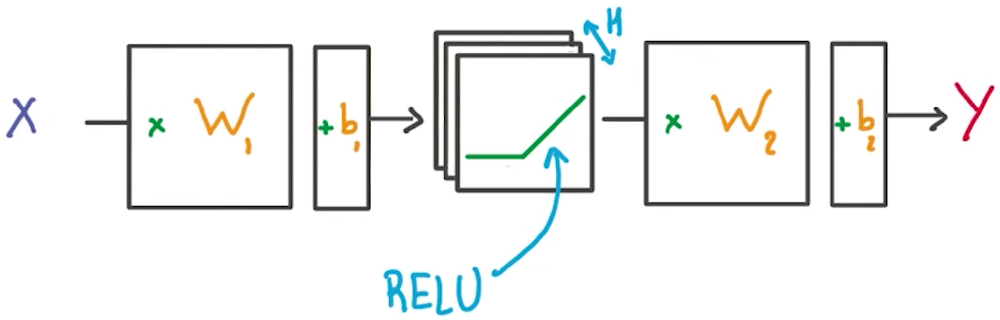

# Multilayer Perceptron Network with TensorFlow

In the following walkthrough, we'll step through TensorFlow code written to classify the letters in the MNIST database. If you would like to run the network on your computer, the file is provided [here](https://d17h27t6h515a5.cloudfront.net/topher/2017/February/58a61a3a_multilayer-perceptron/multilayer-perceptron.zip). You can find this and many more examples of TensorFlow at [Aymeric Damien's GitHub repository](https://github.com/aymericdamien/TensorFlow-Examples).


```python
# Start importing tensorflow module and example data 

import tensorflow as tf
from tensorflow.examples.tutorials.mnist import input_data
```

You'll use the MNIST dataset provided by TensorFlow, which batches and One-Hot encodes the data for you.


```python
mnist = input_data.read_data_sets(".", one_hot=True, reshape=False)
```

    Extracting .\train-images-idx3-ubyte.gz
    Extracting .\train-labels-idx1-ubyte.gz
    Extracting .\t10k-images-idx3-ubyte.gz
    Extracting .\t10k-labels-idx1-ubyte.gz
    

## Learning Parameters

The focus here is on the architecture of multilayer neural networks, not parameter tuning, so here we'll just give you the learning parameters.


```python
# Parameters
learning_rate = 0.001
training_epochs = 20
batch_size = 128  # Decrease batch size if you don't have enough memory
display_step = 1

n_input = 784  # MNIST data input (img shape: 28*28)
n_classes = 10  # MNIST total classes (0-9 digits)
```

## Hidden Layer Parameters

The variable n_hidden_layer determines the size of the hidden layer in the neural network. This is also known as the width of a layer.


```python
n_hidden_layer = 256  # layer number of features
```

## Weights and Biases

Deep neural networks use multiple layers with each layer requiring it's own weight and bias. The `'hidden_layer'` weight and bias is for the hidden layer. The `'out'` weight and bias is for the output layer. If the neural network were deeper, there would be weights and biases for each additional layer.


```python
# Store layers weight & bias
weights = {
    'hidden_layer': tf.Variable(tf.random_normal([n_input, n_hidden_layer])),
    'out': tf.Variable(tf.random_normal([n_hidden_layer, n_classes]))
}
biases = {
    'hidden_layer': tf.Variable(tf.random_normal([n_hidden_layer])),
    'out': tf.Variable(tf.random_normal([n_classes]))
}
```

## Input

The MNIST data is made up of 28px by 28px images with a single channel. The `tf.reshape()` function above reshapes the **28px by 28px** matrices in x into row vectors of **784px**.


```python
# tf Graph input
x = tf.placeholder("float", [None, 28, 28, 1])
y = tf.placeholder("float", [None, n_classes])

x_flat = tf.reshape(x, [-1, n_input])
```

## Multilayer Perceptron



You've seen the linear function `tf.add(tf.matmul(x_flat, weights['hidden_layer']), biases['hidden_layer'])` before, also known as `xw + b`. Combining linear functions together using a ReLU will give you a two layer network.


```python
# Hidden layer with RELU activation
layer_1 = tf.add(tf.matmul(x_flat, weights['hidden_layer']), biases['hidden_layer'])
layer_1 = tf.nn.relu(layer_1)
# Output layer with linear activation
logits = tf.matmul(layer_1, weights['out']) + biases['out']
```

## Optmizer

This is the same optimization technique used in the Intro to TensorFLow lab. This defines how we calculate the cost (how much we missed) and how to propagate the changes back to the network and optimize our weights.


```python
# Define loss and optimizer
cost = tf.reduce_mean(tf.nn.softmax_cross_entropy_with_logits(logits=logits, labels=y))
optimizer = tf.train.GradientDescentOptimizer(learning_rate=learning_rate).minimize(cost)
```

## Session

The MNIST library in TensorFlow provides the ability to receive the dataset in batches. Calling the `mnist.train.next_batch()` function returns a subset of the training data.


```python
# Initializing the variables
init = tf.global_variables_initializer()

# Launch the graph
with tf.Session() as sess:
    sess.run(init)
    # Training cycle
    for epoch in range(training_epochs):
        total_batch = int(mnist.train.num_examples/batch_size)
        # Loop over all batches
        for i in range(total_batch):
            batch_x, batch_y = mnist.train.next_batch(batch_size)
            # Run optimization op (backprop) and cost op (to get loss value)
            sess.run(optimizer, feed_dict={x: batch_x, y: batch_y})
        # Display logs per epoch step
        if epoch % display_step == 0:
            c = sess.run(cost, feed_dict={x: batch_x, y: batch_y})
            print("Epoch:", '%04d' % (epoch+1), "cost=", \
                "{:.9f}".format(c))
    print("Optimization Finished!")
    
        # Test model
    correct_prediction = tf.equal(tf.argmax(logits, 1), tf.argmax(y, 1))
    # Calculate accuracy
    accuracy = tf.reduce_mean(tf.cast(correct_prediction, "float"))
    # Decrease test_size if you don't have enough memory
    test_size = 256
    print("Accuracy:", accuracy.eval({x: mnist.test.images[:test_size], y: mnist.test.labels[:test_size]}))
```

    Epoch: 0001 cost= 38.676704407
    Epoch: 0002 cost= 22.308265686
    Epoch: 0003 cost= 23.439596176
    Epoch: 0004 cost= 15.547880173
    Epoch: 0005 cost= 11.932792664
    Epoch: 0006 cost= 14.575439453
    Epoch: 0007 cost= 12.958477974
    Epoch: 0008 cost= 12.195791245
    Epoch: 0009 cost= 8.750441551
    Epoch: 0010 cost= 7.709659576
    Epoch: 0011 cost= 7.771996498
    Epoch: 0012 cost= 8.167833328
    Epoch: 0013 cost= 7.041287422
    Epoch: 0014 cost= 11.097917557
    Epoch: 0015 cost= 9.152450562
    Epoch: 0016 cost= 7.947066307
    Epoch: 0017 cost= 4.876762390
    Epoch: 0018 cost= 6.835078239
    Epoch: 0019 cost= 5.246541023
    Epoch: 0020 cost= 3.010138512
    Optimization Finished!
    Accuracy: 0.832031
    

## Deeper Neural Network


That's it! Going from one layer to two is easy. Adding more layers to the network allows you to solve more complicated problems. In the next video, you'll see how changing the number of layers can affect your network.
